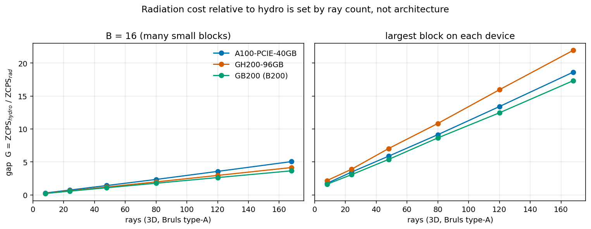
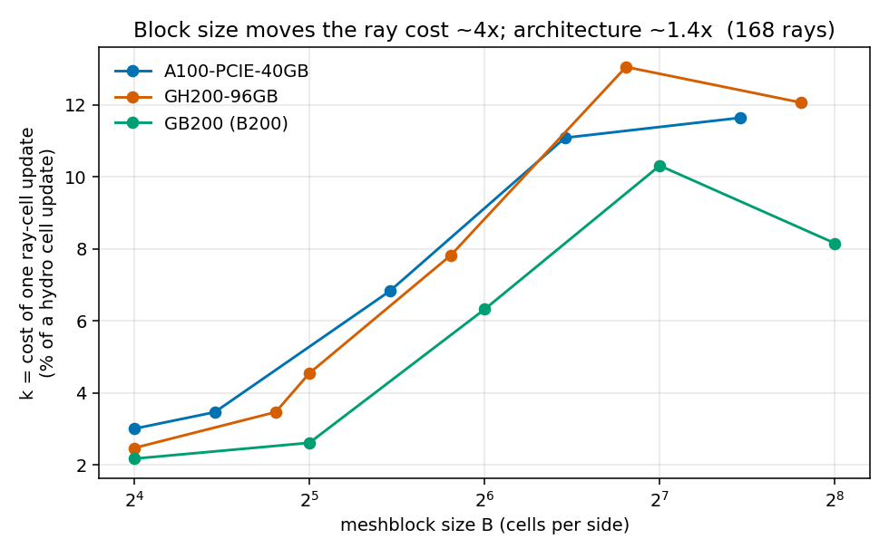
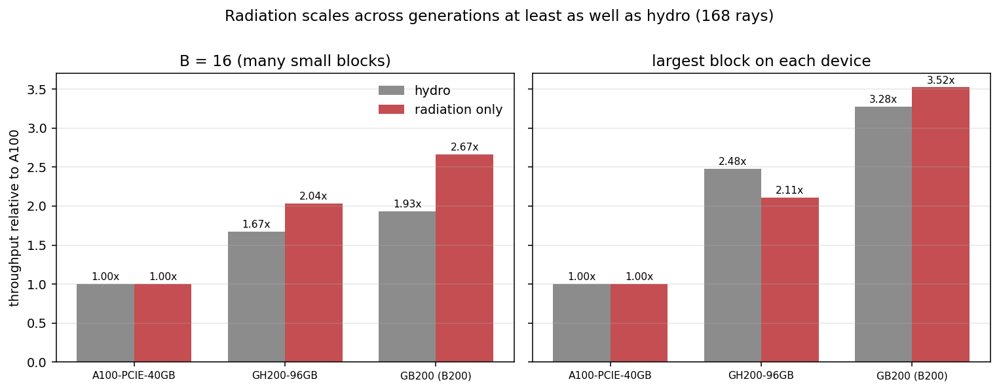
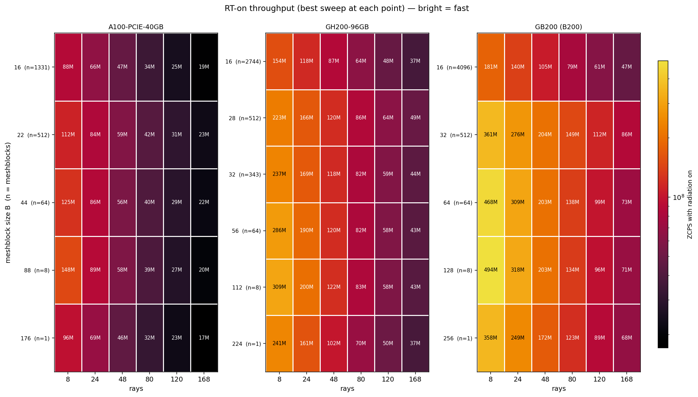
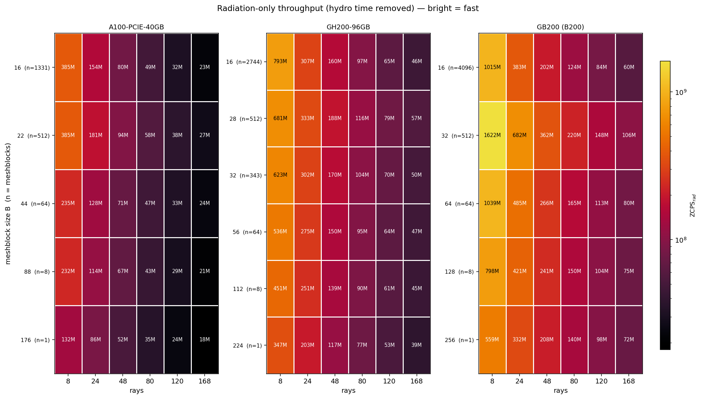
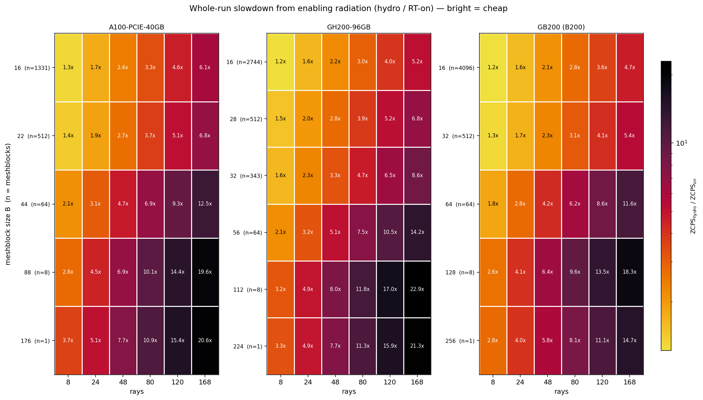
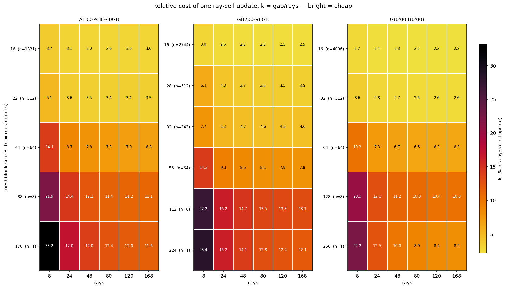
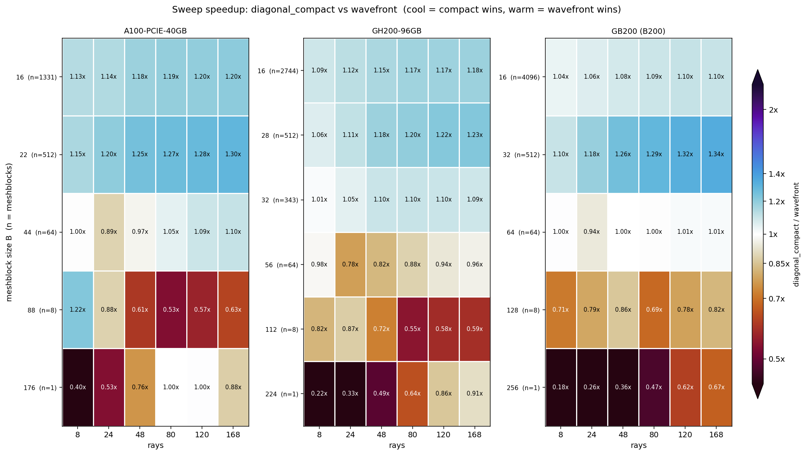

# How the hydro-vs-RT cost gap depends on GPU architecture — A100 / GH200 / B200

*SC short-characteristics solver, branch `rt-sc`. A100 data 2026-08-07/10 (Apollo, `c94cef03` +
the `diagonal_compact` A/B); GH200 and B200 data 2026-08-11 (TACC Vista, jobs 903230/903247-9
and 903411/903471-3). Analysis: `arch_scaling.py`; figures in `arch/`. Companion to `REPORT.md`
(single-device A100 study) and `OPTIMIZATION_LEDGER.md`.*

## TL;DR

- **The gap is a property of the problem, not the machine.** The cost of the radiation sweep
  relative to hydro is set almost entirely by **ray count** and **meshblock size**. Across three
  GPU generations spanning 3.3× in hydro throughput, the gap moves by only ~1.4×.
- **`gap ≈ k × rays`, and k is nearly constant in ray count.** Over rays 24→168 (a 7× range),
  k varies by **≤0.22 percentage points** on every device. One ray-cell update costs
  **k ≈ 2.2–3.0 %** of a hydro cell update at B=16, rising to **~8–13 %** at the largest blocks.
- **Radiation scales across generations at least as well as hydro.** A100→B200 at 168 rays:
  hydro **1.93×**, radiation **2.67×** at B=16; hydro **3.28×**, radiation **3.52×** at the
  largest block. The gap **narrows or holds flat** — it does not widen.
- **The sweep crossover is architecture-invariant** in the variable that matters: on all three
  devices `diagonal_compact` wins for **nmb ≳ 64 meshblocks** and `wavefront` wins for nmb ≤ 8.
  The control parameter is the team count `league = nmb × nang_tot`, not the block size in cells.
- **One genuine architecture effect:** the diagonal sweep's register pressure jumps on Blackwell
  (**94 → 122 regs**, sm80/sm90 → sm_100), deepening its occupancy handicap. The wavefront rises
  more modestly (62 → 72).

> **Correction to an earlier claim.** A first pass at this data reported that "the hydro/RT gap
> widens on newer hardware." That was wrong. It came from dividing B200's best-RT ZCPS (at B=32)
> by B200's best-hydro ZCPS (at B=128) — two *different* configurations. The hydro block-size
> curve is steep (2.2e8 → 1.3e9 from B=16 to B=128), so a cross-config ratio measures the block
> ladder, not the architecture. With configs matched, the trend reverses.

## 1. Provenance — the Vista `diagonal_compact` runs are real and independent

`diagonal_compact` was measured on **both** Vista GPUs as its own job (GH200 903249,
B200 903473, per each `DEVICE_INFO.md`), not carried over from the A100 A/B or re-labelled
from the `diagonal` data. Checks run against the CSVs:

| check | GH200 | B200 |
|---|---|---|
| phase-2 grid complete | 36/36 (6 blocks × 6 ray counts) | 30/30 (5 × 6) |
| missing `zcps_on_med` | 0 | 0 |
| `device` / `sweep` / `N` columns | gh200 / diagonal_compact / 224 | b200 / diagonal_compact / 256 |
| protocol matches other sweeps | `n_repeat=3`, `nlim=50`, `niter=1` | same |
| rows byte-identical to the `diagonal` file (`zcps_on`) | **0/36** | **0/30** |
| rows byte-identical to the `diagonal` file (`zcps_off`) | **0/36** | **0/30** |
| hydro baseline independently remeasured | median 0.06 %, max 0.29 % from the diagonal job | median 0.28 %, max 1.07 % |
| carries its own live GPU telemetry | yes (61 °C / 423 W vs wavefront's 39 °C / 450 W) | yes (same node-average signature as the other B200 jobs) |

The zero byte-identical counts rule out a copy; the small-but-nonzero hydro-baseline differences
are exactly the signature of a genuine separate job on the same machine; and the per-job
telemetry differs in the way a later job in a warming batch should. **Verified.**

## 2. Metric

All numbers come from clean whole-run ZCPS pairs (`affect_fluid=false`, so hydro is bit-identical
on/off and the delta is the *total* radiation cost including bvals) — never the fenced per-kernel
`rad_cells_per_s`, per the ledger's golden rule.

| symbol | definition | meaning |
|---|---|---|
| `ZCPS_hydro` | `zcps_off_med` | radiation off |
| `ZCPS_rad` | `1/(1/ZCPS_on − 1/ZCPS_hydro)` | **radiation-only** throughput, hydro time removed |
| **gap `G`** | `ZCPS_hydro / ZCPS_rad` | radiation work for one zone-cycle, in hydro-zone-cycle units |
| **ray cost `k`** | `G / rays` | cost of one *ray-cell* update, as a fraction of a hydro cell update |

`G` is exactly `slowdown − 1`, i.e. the slowdown with the hydro baseline divided out. It is the
honest cross-device quantity because it does not inherit each machine's hydro speed.

**Both terms of `G` must come from the same run** — same block size, same ray count. That is the
methodological point the correction above turns on.

*Run-to-run error bar (free):* the hydro baseline is remeasured in each of the three sweep jobs
per device. Median spread across configs: **A100 1.7 % (max 4.1 %), GH200 0.3 %, B200 0.4 %**.
A100's looser spread reflects unpinned clocks on a shared PCIe node; treat A100 differences
below ~5 % as noise, and GH200/B200 below ~1 %.

## 3. The gap is linear in ray count, with an architecture-dependent slope

At B=16, the one block size all three ladders share:

| rays | A100 gap | A100 k | GH200 gap | GH200 k | B200 gap | B200 k |
|--:|--:|--:|--:|--:|--:|--:|
| 8 | 0.30 | 3.71 % | 0.24 | 3.01 % | 0.22 | 2.71 % |
| 24 | 0.74 | 3.08 % | 0.62 | 2.60 % | 0.58 | 2.40 % |
| 48 | 1.43 | 2.97 % | 1.20 | 2.50 % | 1.09 | 2.27 % |
| 80 | 2.35 | 2.93 % | 1.98 | 2.47 % | 1.78 | 2.22 % |
| 120 | 3.57 | 2.97 % | 2.96 | 2.47 % | 2.63 | 2.20 % |
| 168 | 5.06 | 3.01 % | 4.16 | 2.47 % | 3.66 | 2.18 % |
| **mean, rays ≥ 24** | | **2.99 %** | | **2.50 %** | | **2.25 %** |
| **spread, rays ≥ 24** | | 0.15 pp | | 0.13 pp | | 0.22 pp |



`k` is flat to within a fifth of a percentage point over a 7× range in rays — the sweep really
does cost a fixed amount per ray, exactly as the algorithm implies (one `UpdateCellSC` per cell
per ray, no ray-count-dependent overhead). The 8-ray column sits high on every device: at that
angular order the fixed per-cycle costs (bvals, moments, `Q_rad`) are no longer negligible next
to the sweep, which inflates `k` when it is attributed entirely to rays.

**Practical form of the law:** budget `slowdown ≈ 1 + k·rays`, with `k` read off §3 for your
block size. At 48 rays and 16³ blocks that is ~2.1× on A100, ~2.1× on B200 — and this is the
number that has stayed stable across three generations.

## 4. Block size is the dominant lever — 4×, versus 1.4× for architecture

At 168 rays:

| B (A100) | k | B (GH200) | k | B (B200) | k |
|--:|--:|--:|--:|--:|--:|
| 16 | 3.01 % | 16 | 2.47 % | 16 | 2.18 % |
| 22 | 3.47 % | 28 | 3.47 % | 32 | 2.62 % |
| 44 | 6.83 % | 32 | 4.55 % | 64 | 6.33 % |
| 88 | **11.09 %** | 56 | 7.83 % | 128 | **10.32 %** |
| 176 | **11.65 %** | 112 | **13.06 %** | 256 | 8.16 % |
| | | 224 | 12.07 % | | |



Going from 16³ blocks to the largest block costs **~4× in relative radiation cost** on every
device; the entire spread *between* architectures at fixed block size is **~1.4×**. This is not
because radiation gets slower with big blocks — `ZCPS_rad` is roughly flat in B — but because
**hydro gets much faster** (A100 1.14e8 → 3.95e8; B200 2.2e8 → 1.3e9). The gap widens because the
denominator improves and the numerator does not.

That is the same opposite-pull the A100 report identified, now confirmed to be
architecture-independent: **hydro wants few big blocks, radiation's *sweep* wants many small
ones.** ⚠️ Note "sweep": this section is per-formal-solution. Counting iterations as well
(`LAG_STUDY.md`) reverses the radiation half of that sentence whenever the medium is optically
thin per meshblock — see §10.2.

## 5. Generational scaling: radiation keeps up

Matched configs, 168 rays, relative to A100:

| config | device | hydro | vs A100 | rad-only | vs A100 | gap |
|---|---|--:|--:|--:|--:|--:|
| **B=16** | A100 | 1.14e8 | 1.00× | 2.26e7 | 1.00× | 5.1 |
| | GH200 | 1.91e8 | 1.67× | 4.60e7 | **2.04×** | 4.2 |
| | B200 | 2.20e8 | 1.93× | 6.02e7 | **2.67×** | 3.7 |
| **largest block** | A100 (88) | 3.95e8 | 1.00× | 2.12e7 | 1.00× | 18.6 |
| | GH200 (112) | 9.80e8 | 2.48× | 4.47e7 | 2.11× | 21.9 |
| | B200 (128) | 1.30e9 | 3.28× | 7.47e7 | **3.52×** | 17.3 |



At 48 rays the same pattern holds (B=16: hydro 1.93×, radiation 2.52×; largest block: hydro
3.28×, radiation 3.57×).

**Why radiation scales *better* at B=16.** With thousands of blocks the sweep has enormous
parallelism (`nmb × nang_tot × plane cells`) and behaves as a throughput problem, so it collects
the full benefit of a bigger machine. Hydro at 16³ blocks is the one that is parallelism- and
launch-limited there, gaining only 1.67×/1.93×. The ordering inverts at large blocks, where
hydro is in its comfort zone and the sweep is latency-bound.

The one place radiation lags is **GH200 at large blocks** (2.11× vs hydro's 2.48×) — consistent
with GH200 posting the highest gap in the whole matrix (21.9 at B=112). Blackwell recovers it.

## 6. Where the sweep crossover sits — invariant in team count

Winner and margin, `diagonal_compact` vs `wavefront`:

| rays | device | | | | | |
|--:|:--|:--|:--|:--|:--|:--|
| | **A100** | B=16 (n=1331) | B=22 (n=512) | B=44 (n=64) | B=88 (n=8) | B=176 (n=1) |
| 48 | | dc 1.18× | dc 1.25× | wf 1.03× | wf 1.65× | wf 1.32× |
| 168 | | dc 1.20× | dc 1.30× | dc 1.10× | wf 1.60× | wf 1.14× |
| | **GH200** | B=16 (n=2744) | B=28 (n=512) | B=32 (n=343) | B=56 (n=64) | B=112 (n=8) |
| 48 | | dc 1.15× | dc 1.18× | dc 1.10× | wf 1.21× | wf 1.38× |
| 168 | | dc 1.18× | dc 1.23× | dc 1.09× | wf 1.04× | wf 1.69× |
| | **B200** | B=16 (n=4096) | B=32 (n=512) | B=64 (n=64) | B=128 (n=8) | B=256 (n=1) |
| 48 | | dc 1.08× | dc 1.26× | wf 1.00× | wf 1.17× | wf 2.80× |
| 168 | | dc 1.10× | dc 1.34× | dc 1.01× | wf 1.22× | wf 1.49× |

Read by **nmb**, not by B, the three devices agree: **`diagonal_compact` wins for nmb ≥ 64**
(marginally so exactly at 64 — 1.00–1.10×) **and `wavefront` wins for nmb ≤ 8.** That is the
expected behaviour if the control parameter is the diagonal's team count
`league_size = nmb × nang_tot`: at nmb=64 and 168 rays that is ~10⁴ teams, enough to fill any of
these GPUs; at nmb=8 it is ~1.3×10³ and the diagonal starves. The block ladder is too coarse
(factor-2 steps) to pin the crossover more finely than "between 8 and 64 blocks".

`diagonal_compact` is the best sweep at every nmb ≥ 64 point on all three devices — it never
loses to baseline `diagonal` anywhere in the matrix, reproducing the A100 A/B verdict on two more
architectures. **The recommendation to promote it to the default `diagonal` now has three-device
support.**

## 7. Register pressure — the one real architecture effect

Static per-kernel registers from `cuobjdump` (`kernel_resources.csv`), no rebuild:

| kernel | sm80 (A100) | sm90 (GH200) | sm_100 (B200) |
|---|--:|--:|--:|
| `FormalSolutionDiagonal` | 94 | 94 | **122** |
| `FormalSolutionWavefront` | 54–62 | 54–60 | 56–72 |
| `FormalSolutionJacobi` | 70 | 62 | 72 |
| `SweepUpdateGS` | 46–68 | 47–66 | 47–76 |

No kernel spills on any architecture. The diagonal's **+30 % register jump on Blackwell** widens
its standing occupancy disadvantage versus the wavefront, and is the most likely reason its
large-block collapse is if anything sharper on B200 (wf 2.80× at B=256, 48 rays — the largest
wavefront margin anywhere in the matrix). It also strengthens the case for **ledger I3** (hoist
the angle-only invariants out of `UpdateCellSC`): register relief is worth more on sm_100 than it
was on sm80, and I3 is the cheap, portable way to get it.

## 8. The full (block size × rays) plane

The tables above sample the corners; these are the whole surface. All panels share a colour
scale across the three devices, so cross-device differences read directly as colour, and every
cell is annotated with its value — the colour carries the pattern, the number carries the fact.
Rows are labelled with both the block size and the resulting meshblock count `n`.

**RT-on throughput** — what you actually get with radiation enabled. The generational gain is the
overall brightening from left panel to right; the ray-count cost is the darkening to the right
within each panel.



**Radiation-only throughput** (hydro time removed) — the same surface with the hydro contribution
divided out, i.e. the sweep's own speed.



**Whole-run slowdown** from enabling radiation. Contours of constant slowdown run diagonally, so
the two levers are interchangeable within limits: on A100 the ~4.6× contour passes through
(B=16, 120 rays) = 4.6×, (B=44, 48 rays) = 4.7× and (B=88, 24 rays) = 4.5× — a 5.5× change in
block size trading against a 5× change in ray count. If a run is too slow, shrinking the blocks
and cutting the angular order are near-equivalent moves on this surface; only one of them costs
you physics.



**Relative ray cost `k`** — the normalised version, and the clearest statement of the whole
report. Within any row the numbers are nearly constant across rays (the `k ≈ const` law of §3);
down any column they rise ~4× (the block-size effect of §4); and between panels they shift only
mildly, with B200 systematically the cheapest. The 8-ray column is the one visible departure,
for the fixed-cost reason given in §3.



**Sweep choice** — `diagonal_compact` versus `wavefront` over the same plane. Cool = compact
wins, warm = wavefront wins, white = tie; the scale is clipped at ±1.2 in log₂ so the decisive
1.0–1.35× band stays readable (five extreme cells saturate and carry their printed value).
The boundary is flat in `n`, not in `B`, on all three devices — and compaction's advantage
*grows* with ray count in the regime where it wins (left-to-right brightening in the top rows),
while the wavefront's advantage grows as blocks get bigger.



*Figure method: sequential ramps are perceptually uniform and monotonic in OKLab lightness,
oriented so bright always means good; the diverging ramp has an exactly neutral (chroma 0.00)
midpoint so "no difference" reads as white; the three device colours clear an OKLab ΔE ≥ 8
dichromat-separation floor under simulated protanopia, deuteranopia and tritanopia. All of this
is checked by `python3 arch_scaling.py --check-palette` rather than asserted — the default
seaborn palette the first draft used failed that check (ΔE 5.2 protan on its orange/green pair)
and was replaced.*

## 9. Caveats

- **B200 GPU telemetry in the CSVs is wrong — do not use it.** The `sm_util_mean` /
  `dcgm_sm_occ_mean` / `sm_clock_mhz` / `power_w` columns for B200 read 20.7 % / 0.094 /
  640 MHz / 260 W, which is not consistent with a device delivering 1.3e9 ZCPS. The GB200 node
  has 4 GPUs and the job uses 1: every one of those numbers is ≈¼ of a plausible value
  (20.7×4 ≈ 83 % SM-util, 0.094×4 ≈ 0.37 occupancy — both in line with A100/GH200), so the
  sampler is averaging the node instead of the active GPU. **Fix:** restrict the `nvidia-smi
  dmon` / `dcgmi dmon` call to `$CUDA_VISIBLE_DEVICES` in `run_sweep.py`. ZCPS numbers are
  unaffected (they come from the driver, not the sampler).
- **Different meshes.** N★ differs per device (A100 176³/90 % fill, GH200 224³/77 %,
  B200 256³/59 %) because each is the largest 16-divisible mesh that fits. B200's is set by a
  coarse ladder — 320³ needs 182 GiB and OOMs — so B200 runs at lower memory fill than the
  others. ZCPS is a rate, so this is second-order, but it is not a perfectly controlled variable.
- **Different block ladders.** Only B=16 is exactly common; §3–§5 comparisons at "the largest
  block" pair 88/112/128, which are similar but not identical.
- **A100 `diagonal_compact` comes from a separate job** (the 2026-08-10 A/B run) rather than the
  phase-2 grid, so A100 dc-vs-wf margins carry a slightly larger uncertainty than GH200/B200,
  where all three sweeps ran in one batch.
- Clocks unpinned on all three (admin); median-of-3 with same-node OFF/ON pairing controls it.
- H200 has submit scripts but **no data** — `h200/` contains only `submit_*.sbatch`.

## 10. Practical guidance

1. **Budget radiation as `slowdown ≈ 1 + k·rays`.** Use k ≈ 2.2–3.0 % for 16³ blocks, ~8–13 % for
   ≥88³ blocks. This has held across three generations, so A100-derived estimates transfer.
   ⚠️ This is a **per-sweep** number, measured at one formal solution per cycle. Multiply by the
   iteration count from `LAG_STUDY.md` for a real run.
2. **Block size depends on the optical depth per meshblock, `τ_blk = χ·(block size)`** — this
   supersedes the earlier unqualified "radiation wants many small blocks", which was measured at
   `iter_max=1` and is only right when the medium is thick (`LAG_STUDY.md`, 2026-08-11):
   - **`τ_blk ≳ 3` (thick):** iteration count is flat in the decomposition, so per-sweep
     throughput decides → **16–32³ blocks with `diagonal_compact`**, as before.
   - **`τ_blk ≲ 1` (thin):** the sweep is meshblock-local, so `niter = 3·(blocks per side) − 1`
     and iteration count dominates → **use the largest meshblocks you can afford**. On B200,
     16³ blocks cost **28× more total radiation time** than a single block. This also happens to
     be what hydro wants, so in this regime the block-size tension disappears.
3. **Do not expect newer hardware to close the gap for you.** It won't widen either, but the gap
   at fixed configuration is essentially a constant of the algorithm. Reducing it means
   attacking the latency-bound footpoint gather (ledger **I2**/**I3**), not waiting for silicon.
4. **`diagonal_compact` for nmb ≥ 64, `wavefront` for nmb ≤ 8**, on all three architectures.
5. **At scale, expect iteration count to grow as `nranks^(1/3)`** (a rank owns ≥1 block), which
   caps strong scaling of the transport solve regardless of kernel speed. The fix is a globally
   ordered pipelined sweep — ledger I9, `LAG_STUDY.md` §7.

## 11. Reproduce

```bash
python3 rt-profiling/arch_scaling.py            # tables to stdout, figures -> rt-profiling/arch/
```
Inputs: `{a100,gh200,b200}/results_{wavefront,diagonal,diagonal_compact}.csv`,
`a100/diagonal_compact/results_both.csv`, `{a100,gh200,b200}/kernel_resources.csv`.
Per-device run metadata: `{b200,gh200}/DEVICE_INFO.md`.
