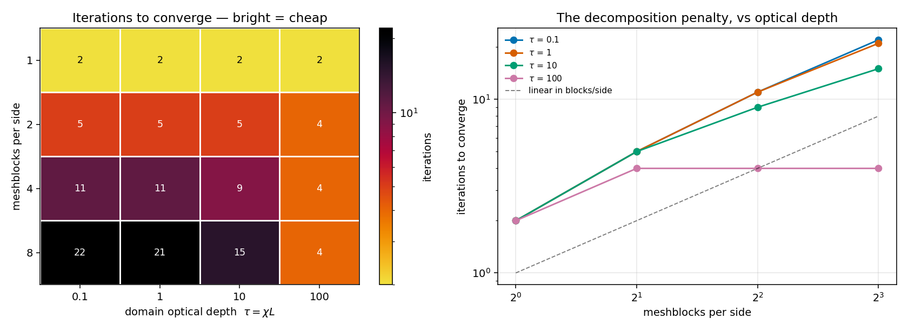

# The boundary-lag study — what a domain decomposition costs in iterations

*Probe: `src/pgen/unit_tests/sc_lag.cpp` + `tst/inputs/sc_lag.athinput`. Driver/analysis:
`lag_study.py`. Data: `lag/lag_results.csv`, figure `lag/lag_iterations.png`. Run 2026-08-11 on
a laptop serial CPU build (`build_lag`) — iteration count is a property of the algorithm, not
the hardware, and §4 shows it is independent of angular order, so the result transfers to any
GPU. **This overturns the block-size guidance in `ARCH_SCALING.md` §10 for optically thin
problems.***

## TL;DR

- The SC sweep is meshblock-local, so light advances **one meshblock per iteration**. The
  iteration count is therefore the **meshblock-wavefront depth**, and it is exact:
  **`niter = 3·(blocks per side) − 1`** in 3D (measured 2, 5, 11, 22 for 1, 2, 4, 8 blocks/side —
  predicted 2, 5, 11, 23).
- That cost is **invisible in every throughput number in this directory**, all of which were
  taken at `iter_max = itermin = 1`.
- It saturates when the medium is optically thick: at τ=100 the count is flat at 4 regardless of
  decomposition, because light is absorbed before it can cross a block. The control parameter is
  the **optical depth per meshblock**, `τ_blk = χ · (block physical size)`.
- Folding it into the measured per-sweep throughput **inverts the recommendation for thin
  problems**: on B200, 16³ blocks cost **28×** more total radiation time than one big block.
  For thick problems the old guidance survives — 32³ is still best, by a small margin.
- Implication for scaling: since `nblk ≥ nranks`, iteration count grows as **nranks^(1/3)**.
  This is the classic parallel-sweep problem and it caps strong scaling of SC transport.

## 1. The mechanism

`SolveTransfer` refreshes ghosts and then sweeps ([iteration.cpp:534](../src/nr_radiation/sc/iteration.cpp)):

```
loop:  ExecuteTaskList("sc_bvals")   →  FormalSolution()  →  ComputeJ()  →  residual
```

The sweep never leaves a meshblock; the only path for light to cross a block boundary is the
ghost exchange at the top of the next iteration. So this is **block-Jacobi with boundary lag**,
and converging the domain requires as many iterations as it takes a ray to hop across it.

## 2. The probe

Uniform emitting medium (χ, S = b constant) in a unit cube with **vacuum** boundaries (`inflow`
with the default `i_in = 0`). Intensity is initialised to `b` — the infinite-medium answer,
which is wrong near every face, so a deficit wave must propagate inward from all six boundaries.
LTE (`ops=0, eps=1` ⇒ `use_ali=false`) means the source function is fixed and **the only reason
to iterate is ghost propagation**.

The pgen's loop reproduces `SolveTransfer`'s LTE branch exactly — same ordering, same residual
`max|ΔJ/J|` off the same arrays, same `itermin`/`iter_tol` stopping test — so the count is the
one a production run pays. Mesh fixed at 64³; only `<meshblock>/nx*` and χ vary.

## 3. Result

Iterations to reach `iter_tol = 1e-6`:

| blocks/side | nmb | τ=0.1 | τ=1 | τ=10 | τ=100 |
|--:|--:|--:|--:|--:|--:|
| 1 | 1 | 2 | 2 | 2 | 2 |
| 2 | 8 | 5 | 5 | 5 | 4 |
| 4 | 64 | 11 | 11 | 9 | 4 |
| 8 | 512 | **22** | **21** | 15 | **4** |

Penalty relative to a single meshblock: **11× at 8 blocks/side** when thin, **2× and flat** when
thick.



The thin-limit fit is `niter = 3·n − 1` — exactly the number of hyperplanes in a wavefront over
an n×n×n arrangement of blocks. (`n=1` gives 2 rather than 1 only because `itermin=2` forces a
second, confirming iteration; the residual on it is identically 0.)

The thick limit saturates because a photon is absorbed within ~1/χ; once `τ_blk ≳ 3` the deficit
cannot reach the next block and the decomposition stops mattering.

## 4. Robustness

| check | result |
|---|---|
| **Angular order** | 11 iterations at 4 blocks/side for nmu = 1, 3 **and** 6 — `niter` is angle-independent, as the geometric argument requires. This is what licenses combining it with the nmu=6 throughput data in §5. |
| **Tolerance** | 11 iterations at `iter_tol` = 1e-4, 1e-6 **and** 1e-8. Convergence is not a decay rate — once the wavefront completes, the solution stops changing to machine precision and the residual falls off a cliff. The count is a hard geometric number. |
| **Decomposition invariance** | Converged mean J agrees to **0.00e+00** relative spread across all decompositions at τ = 0.1, 1, 100 (3.7e-08 at τ=10). The probe is measuring convergence *rate*, not a different answer. |

## 5. The deliverable: total cost = iterations × per-sweep cost

Combining the law above with the measured `ZCPS_rad` from `ARCH_SCALING.md` (nmu=6), at each
device's memory-fill mesh. Cost per zone-cycle ∝ `niter / ZCPS_rad`, normalised per column:

### GB200 (B200), N★ = 256³

| B | blocks/side | ZCPS_rad | niter (thin) | **cost thin** | niter (thick) | **cost thick** |
|--:|--:|--:|--:|--:|--:|--:|
| 16 | 16 | 6.02e7 | 47 | **28.3×** | 4 | 1.76× |
| 32 | 8 | 1.06e8 | 23 | 7.9× | 4 | **1.00×** |
| 64 | 4 | 8.02e7 | 11 | 5.0× | 4 | 1.32× |
| 128 | 2 | 7.47e7 | 5 | 2.4× | 4 | 1.41× |
| 256 | 1 | 7.25e7 | 2 | **1.00×** | 4 | 1.46× |

A100 and GH200 give the same shape (thin: 12.7× and 17.4× penalty at B=16; thick: best at
B=22 / B=28). Full tables from `python3 lag_study.py --analyze-only`.

**The optically thin column inverts the guidance completely** — and by more than an order of
magnitude, not at the margin. The optically thick column reproduces the old recommendation.

## 6. Corrected guidance

The block-size choice is governed by **optical depth per meshblock**, `τ_blk = χ · (block size)`:

| regime | choose | why |
|---|---|---|
| `τ_blk ≲ 1` (thin) | **the largest meshblocks you can afford** | iteration count dominates; it falls linearly with block size, and this is also what hydro wants |
| `τ_blk ≳ 3` (thick) | **16–32³**, i.e. the old advice | iterations are flat, so per-sweep throughput decides |

`ARCH_SCALING.md` §10 has been amended accordingly. The unqualified statement "radiation wants
many small meshblocks" was measured at one formal solution per cycle and is only correct in the
optically thick regime.

## 7. Consequence for scaling, and the real fix

A rank must own at least one meshblock, so `nblk ≥ nranks` and therefore

```
niter  ≳  3 · nranks^(1/3)        (3D, optically thin)
```

Iteration count *grows* with rank count: strong scaling of the transport solve is intrinsically
limited, independent of how fast the sweep kernel gets. Doubling ranks in each dimension doubles
the iterations.

This is the classic parallel-sweep problem, and the block-Jacobi-with-one-exchange scheme is the
naive answer to it. The known fix is a **globally ordered (pipelined KBA) sweep** — order the
blocks by the same upwind hyperplane rule used *inside* a block, and pipeline the communication —
which converges in **one** iteration for any decomposition, paying only pipeline fill/drain in
*message latency* rather than in full sweeps of the whole domain.

That is the same algorithm as the tiled sweep proposed in `TILED_SWEEP_DESIGN.md`, promoted from
intra-block to inter-block. Opened as ledger **I9**; it subsumes this entire penalty and is
probably the single highest-value item in the ledger for production runs at scale.

## 8. Reproduce

```bash
cmake -S . -B build_lag -DCMAKE_BUILD_TYPE=Release && cmake --build build_lag --target athena -j
python3 rt-profiling/lag_study.py --blocks 64 32 16 8 --chis 0.1 1.0 10.0 100.0
```

## 9. Caveats

- Single rank; `nmb > 1` here means multiple blocks on one rank. The mechanism is per-*block*, not
  per-rank, so the law should carry over, but the MPI exchange has not been measured (see the
  separate open question on multi-rank RT scaling).
- LTE only, by construction — it isolates boundary lag from scattering convergence. With
  scattering (`use_ali`), the ALI iteration count adds on top; the two are not simply additive
  and the combination has not been measured.
- Uniform medium with vacuum boundaries is the cleanest probe of propagation, not a production
  configuration. A problem whose sources are interior rather than boundary-driven will have a
  smaller effective propagation distance.
- Cubic blocks and a cubic mesh; anisotropic decompositions would follow the same wavefront rule
  with the sum over the three axis counts.
