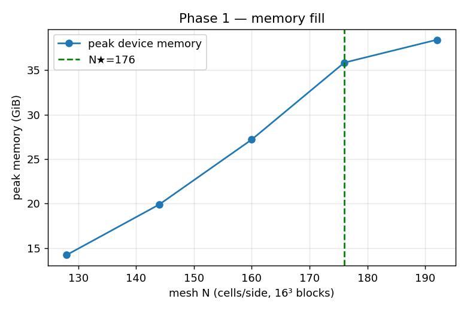
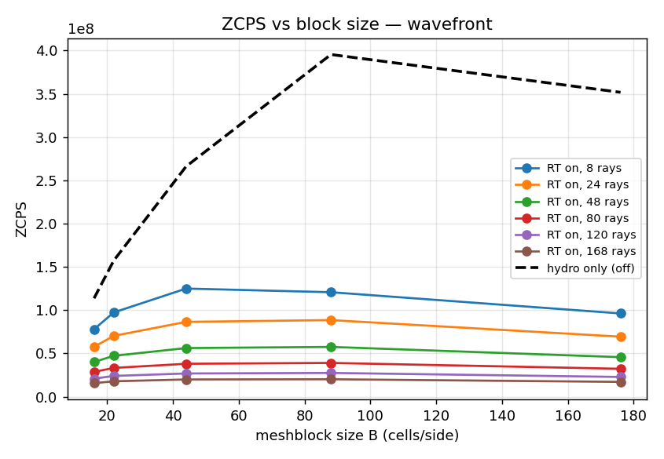
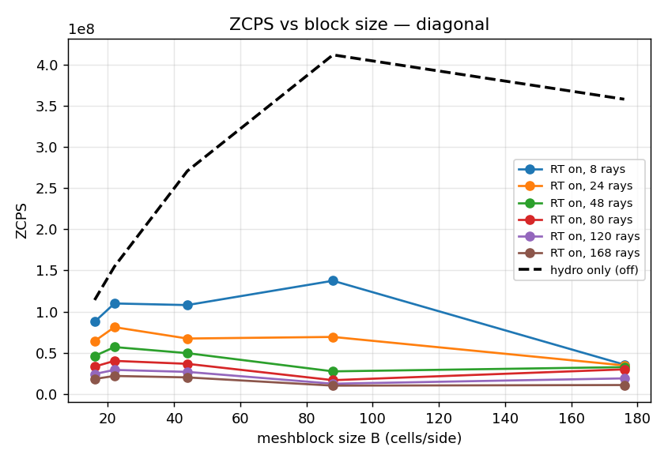
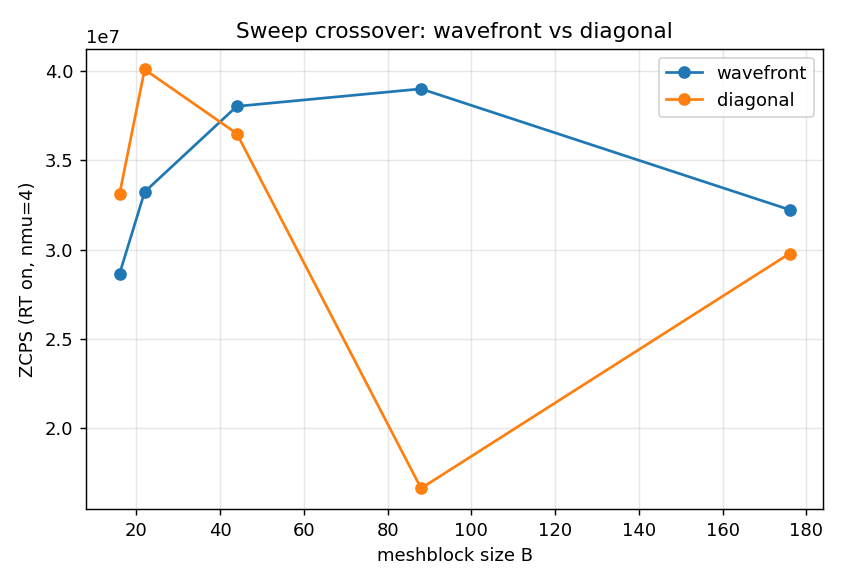
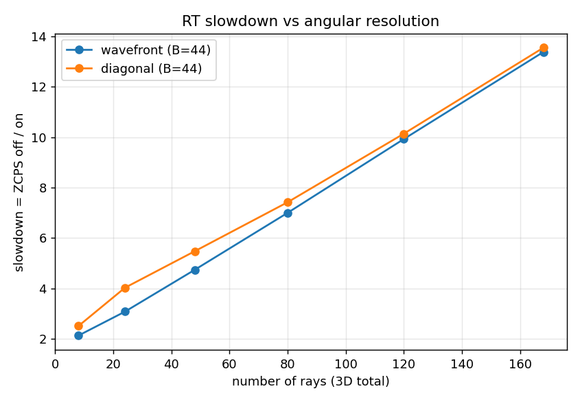

# Controlled hydro vs hydro+RT (LTE SC) GPU speed study — A100

*Apollo A100-PCIE-40GB (driver 580.105.08). Branch `rt-sc`; SC solver = compact-plane wavefront
(`d776ee93`), study scripts `c94cef03`. Run 2026-08-07. Data: `a100/results_phase1.csv`,
`a100/results_wavefront.csv`, `a100/results_diagonal.csv`, `a100/kernel_resources.csv`.*

> **Follow-up (2026-08-11):** this study is A100-only. The same measurement repeated on GH200 and
> B200 is in **`ARCH_SCALING.md`** (+ `{gh200,b200}/SUMMARY.md`), which shows the sweep crossover
> and the hydro/RT gap law are essentially architecture-invariant, and that radiation scales across
> GPU generations at least as well as hydro.

## TL;DR

- **Mesh design is memory-driven.** With 16³ meshblocks and the heaviest angular order (nmu=6, 168
  rays), the largest mesh that fits the 40 GB A100 is **N★ = 176³** (5.45 M zones, **35.8 GiB ≈ 90 %
  fill**); 192³ needs ~38–44 GiB and **OOMs**.
- **Pure hydro** runs at **~1.1×10⁸ ZCPS** on 16³ blocks, climbing to **~4.0×10⁸** on 88³ blocks
  (few big blocks are best for hydro).
- **Adding the LTE SC sweep** costs a factor that grows with angular resolution and with block size:
  at nmu=3 (48 rays) the **slowdown is ≈2.5–7.7×**; at nmu=6 (168 rays) it is **≈6–33×**.
- **The best sweep flips with block size** (as in the prior study): **diagonal wins for small blocks
  (≤22³, ~1.15–1.20×), wavefront wins for large blocks (≥44³, up to 2.1× at 88³)** — crossover ≈32³.
- **Real-time GPU loading & occupancy were captured live without ncu**: `nvidia-smi` SM-util rises
  45→90 % with angle count; **DCGM** gives achieved **SM-occupancy ≈0.33–0.40** and SM-active
  ≈0.61–0.73. Clocks ran 1060–1366 MHz (mild power/thermal throttling; logged, not pinned).
- **Static register pressure:** the SC sweep kernels are lean and un-spilled (wavefront 54–62 regs,
  occ ≈0.5; diagonal 94 regs, occ ≈0.25–0.31); the **hydro LLF flux kernel is the register-heavy,
  spilling one** (84–180 regs, occ 0.13–0.31). The sweep is **not** register-bound — consistent with
  the earlier nsys finding that it is execution/memory-bound.

## 1. Setup

- **Problem:** periodic 3D hydro `linear_wave` (ρ=1, p=0.6, wave_flag=0). Radiation is turned on
  purely by appending an `<nr_radiation>` block — no compile flag, no rebuild.
- **Regime — pure LTE, one formal solution per cycle, NO iteration:** `opa=1, ops=0, eps=1`
  (⇒ `use_ali=false`), `iter_max=itermin=1`, `affect_fluid=false` (hydro is bit-identical on/off, so
  the ZCPS delta is *purely* the SC sweep cost). `nlim=50` cycles, median of `N_REPEAT=3`, one
  discarded warmup per job.
- **Metric:** whole-run **ZCPS** = `zone-cycles/cpu_second` (driver), OFF and ON; plus a
  `file_type=perf` probe splitting device time into radiation (`sc_*`/`gs_*`) vs hydro
  (`h_update`/`hflux_*`).
- **Angles → rays** (Bruls type-A, 3D). Report ray counts, not `nmu`:

  | nmu | 1 | 2 | 3 | 4 | 5 | 6 |
  |-----|---|---|---|---|---|---|
  | rays/octant | 1 | 3 | 6 | 10 | 15 | 21 |
  | **rays (3D total)** | **8** | **24** | **48** | **80** | **120** | **168** |

## 2. Phase 1 — memory-fill (mesh design)

"Fully occupy the A100" here means **fill its memory**, not reach a throughput knee. Held at the
worst corner (**B=16, nmu=6 = 168 rays**), the mesh was grown until it stopped fitting:

| N | zones | peak mem (GiB) | % of 40 GB | result |
|---|------:|---------------:|-----------:|:------:|
| 128 | 2.10 M | 14.2 | 36 % | fits |
| 144 | 2.99 M | 19.9 | 50 % | fits |
| 160 | 4.10 M | 27.2 | 68 % | fits |
| **176** | **5.45 M** | **35.8** | **90 %** | **← N★ (max fill)** |
| 192 | 7.08 M | 38.4→OOM | 96 %+ | **OOM (fails)** |

**N★ = 176³.** It is the largest 16³-divisible mesh that runs; 192³ cannot allocate the
168-ray `ir` array + ghosts/buffers in 40 GB. Memory scales cleanly with zones (∝ N³). Block ladder
for Phase 2 = divisors of 176 ≥ 16 = **{16, 22, 44, 88, 176}** → nmb {1331, 512, 64, 8, 1}
(16³ up to the full mesh as a single block).



## 3. Phase 2 — the 2D sweep (block size × rays) at N★ = 176³

ZCPS **with and without RT** for every (block, ray) cell, for both sweeps. Full grid in the CSVs;
figures below.




### 3.1 Hydro baseline (nmu-independent)
Pure-hydro ZCPS rises with block size — few big blocks are best for hydro:

| block B | 16 | 22 | 44 | 88 | 176 |
|---|---:|---:|---:|---:|---:|
| nmb | 1331 | 512 | 64 | 8 | 1 |
| **hydro ZCPS** | 1.14e8 | 1.56e8 | 2.68e8 | **4.03e8** | 3.55e8 |

(hydro peaks at 88³; a single 176³ block dips slightly.)

### 3.2 Wavefront — ZCPS with/without RT and slowdown

| B | nmb | rays=8 | 24 | 48 | 80 | 120 | 168 | slow@168 |
|--:|----:|-------:|---:|---:|---:|----:|----:|---------:|
| 16 | 1331 | 7.79e7 | 5.76e7 | 4.01e7 | 2.86e7 | 2.09e7 | 1.57e7 | 7.3× |
| 22 | 512 | 9.73e7 | 7.03e7 | 4.72e7 | 3.32e7 | 2.40e7 | 1.78e7 | 8.9× |
| 44 | 64 | 1.25e8 | 8.64e7 | 5.62e7 | 3.80e7 | 2.68e7 | 1.99e7 | 13.4× |
| 88 | 8 | 1.21e8 | 8.85e7 | **5.75e7** | 3.90e7 | 2.75e7 | 2.01e7 | 19.6× |
| 176 | 1 | 9.62e7 | 6.93e7 | 4.57e7 | 3.22e7 | 2.28e7 | 1.71e7 | 20.6× |

### 3.3 Diagonal — ZCPS with/without RT and slowdown

| B | nmb | rays=8 | 24 | 48 | 80 | 120 | 168 | slow@168 |
|--:|----:|-------:|---:|---:|---:|----:|----:|---------:|
| 16 | 1331 | 8.76e7 | 6.41e7 | **4.60e7** | 3.31e7 | 2.41e7 | 1.81e7 | 6.3× |
| 22 | 512 | 1.10e8 | 8.11e7 | **5.69e7** | 4.01e7 | 2.91e7 | 2.17e7 | 7.1× |
| 44 | 64 | 1.08e8 | 6.72e7 | 4.95e7 | 3.65e7 | 2.67e7 | 2.00e7 | 13.5× |
| 88 | 8 | 1.37e8 | 6.92e7 | 2.73e7 | 1.66e7 | 1.23e7 | 9.99e6 | 41.3× |
| 176 | 1 | 3.55e7 | 3.45e7 | 3.25e7 | 2.98e7 | 1.88e7 | 1.07e7 | 33.4× |

### 3.4 The sweep crossover (the headline "which sweep")
At nmu=3 (48 rays), best sweep by block size:

| B | 16 | 22 | 44 | 88 | 176 |
|---|:--:|:--:|:--:|:--:|:--:|
| winner | diag 1.15× | diag 1.20× | wf 1.14× | **wf 2.10×** | wf 1.41× |

**Diagonal wins for small blocks (≤22³), wavefront wins for large blocks (≥44³)** — crossover ≈32³.
Diagonal *collapses* on big blocks (its `TeamPolicy` has too few teams: at 88³ there are 8 blocks and
at 176³ just one, so `league_size = nmb·nang` starves the GPU); wavefront keeps parallelism per plane.
This reproduces the prior study's finding independently. 

### 3.5 Slowdown vs angular resolution
Slowdown grows steeply with rays (per-cell RT cost ≈ quadratic in nmu). 

### 3.6 Caveat: the fenced per-kernel metric vs the clean whole-run cost (2026-08-10 follow-up)
The per-kernel throughput column `rad_cells_per_s` (= zones·nlim / `t_rad`) is derived from the
**perf-probe** run, which calls `Kokkos::fence()` after *every* matched kernel
(`src/utils/perf.cpp` `KernelsProbe::OnEnd`) and counts only `sc_*`/`gs_*` kernels (**excludes radiation
bvals**). Fencing fully exposes the per-launch bubble **526×/cycle at 176³ vs 46×/cycle at 16³**, so this
metric *over-penalises many-launch (big-block) configs*: it falls ~34 % (2.83e7→1.86e7) from 16³→176³.

The **clean whole-run** radiation cost (`t_on − t_off` from the unfenced runs; `affect_fluid=false` ⇒ the
delta is the *total* radiation cost incl. bvals) is **U-shaped, not monotonic** (nmu=6):

| block B | 16³ | 22³ | 44³ | 88³ | 176³ |
|--:|--:|--:|--:|--:|--:|
| clean radiation wall-time (s) | 15.0 | 13.6 | 12.7 | 12.85 | 15.2 |
| clean rad throughput (cells/s) | 1.82e7 | 2.00e7 | 2.15e7 | 2.12e7 | 1.80e7 |

The single 176³ block is ≈ the 16³ cost and only ~16–20 % above the 44–88³ optimum. A **fence-free nsys**
follow-up (`a100/launch_overhead/SUMMARY.md`) then measured the sweep's true inter-plane launch/ramp gap:
a ~fixed **~18–23 µs/plane**, giving a recoverable **gap_fraction of 3.9 % (176³), 2.3 % (88³), 0.5 %
(16³)** at nmu=6 — i.e. the big-block penalty is **in-kernel latency**, not launch overhead. (It reaches
12 % only for the non-production corner of nmu=3 on a single 176³ block, where kernels are both lean and
maximally numerous.) **Practical takeaway:** compare sweeps on *whole-run* wall-time, not the fenced
`rad_cells_per_s`; and a fused single-launch sweep ("Lever 1") is **not** worth building — the real
targets are the latency-bound footpoint gather and the diagonal's big-block team starvation.

## 4. Real-time GPU loading & occupancy (live, no ncu)

Every run was monitored live with `nvidia-smi dmon` (SM-util %, mem-util %, clock, power, temp) **and
DCGM** (`dcgmi dmon -e 1002,1003` — SM-active, SM-occupancy; the Phase-0 probe found DCGM available on
Apollo, so real-time occupancy is available *without* the admin-blocked Nsight Compute counters):

| sweep | B | rays | SM-util % | mem-util % | **DCGM SM-occ** | DCGM SM-act | clk MHz | pwr W |
|---|--:|-----:|----------:|-----------:|----------------:|------------:|--------:|------:|
| wavefront | 16 | 8 | 45.7 | 16.4 | 0.347 | 0.624 | 1100 | 144 |
| wavefront | 16 | 168 | 88.2 | 38.6 | 0.398 | 0.725 | 1290 | 222 |
| wavefront | 176 | 168 | 78.1 | 34.9 | 0.356 | 0.664 | 1190 | 212 |
| diagonal | 88 | 168 | 89.9 | 53.7 | 0.371 | 0.702 | 1350 | 230 |
| diagonal | 176 | 168 | 90.8 | 50.3 | 0.323 | 0.625 | 1370 | 226 |

Reading: **SM-util (time-busy) climbs 45→90 %** with angle count; **achieved SM-occupancy stays modest,
~0.33–0.40** — the sweep occupies the SMs' *time* well but not their *warp slots*, i.e. it is
latency/execution-bound rather than occupancy-starved. Clocks ran **1060–1366 MHz** (below the
1410 MHz boost — mild power/thermal throttling under the heaviest runs; recorded, not pinned, since
locking clocks needs the same admin rights that block ncu). Median-of-3 + same-node OFF/ON pairing
control for this.

## 5. Register pressure & occupancy (static, from `cuobjdump`)

Per-kernel registers/spills straight from the binary (no admin, no rebuild); theoretical occupancy
from regs + shared-mem vs A100 limits. Representative (full table in `a100/kernel_resources.csv`):

| kind | kernel | regs | spills | theo. occ @256 |
|------|--------|-----:|:------:|---------------:|
| sweep | FormalSolutionWavefront | 54–62 | no | 0.50 |
| sweep | FormalSolutionJacobi | 70 | no | 0.375 |
| sweep | SweepUpdateGS | 46–68 | no | 0.375–0.625 |
| sweep | **FormalSolutionDiagonal** | **94** | no | **0.25–0.31** |
| hydro | RKUpdate (`h_update`) | 22–47 | some | 0.625–1.0 |
| hydro | **CalculateFluxes (`hflux_*`)** | **84–180** | **yes** | **0.125–0.31** |

Two takeaways: (i) the **SC sweep kernels are lean and never spill** (wavefront occ ≈0.5), so the
sweep's low throughput is **not** register pressure — it matches the earlier nsys verdict
(memory-bound footpoint gather, execution-bound plane chain). (ii) **Diagonal carries ~50 % more
registers than wavefront** (94 vs 62 → half the theoretical occupancy), which — together with its
team-count starvation on big blocks — explains why diagonal loses badly at 88³/176³. The genuinely
register-heavy, *spilling* kernel is hydro's templated LLF Riemann solver (`CalculateFluxes`), not
radiation. *Achieved per-kernel occupancy/warp-efficiency remains ncu-only and admin-blocked.*

## 6. Practical guidance

- **Radiation wants many small blocks; hydro wants few big blocks** — opposite pulls. If radiation
  cost dominates, keep meshblocks ~16–32³ and use the **diagonal** sweep; for hydro-dominated runs
  with big blocks, **wavefront** is both faster and the safer default (diagonal collapses there).
- A completed LTE radiation cell-update at nmu=3 costs **≈2.5–7× a hydro one** on the A100 (block
  dependent); at nmu=6 (168 rays), **≈6–33×**. Budget angular resolution accordingly.
- The A100 tops out at ~5.7×10⁷ RT-on ZCPS (nmu=3, wavefront, 88³) vs ~4×10⁸ pure-hydro.

## 7. Reproduce & files

```bash
sbatch rt-profiling/a100/submit_phase1.sbatch                    # -> N* via results_phase1.csv
RT_N_STAR=176 RT_SWEEPS=wavefront RT_OUT=.../a100/wf   sbatch rt-profiling/a100/submit_sweep.sbatch
RT_N_STAR=176 RT_SWEEPS=diagonal  RT_OUT=.../a100/diag sbatch rt-profiling/a100/submit_sweep.sbatch
python3 rt-profiling/analyze.py rt-profiling/a100                # tables + PNGs
```
Data: `a100/results_phase1.csv`, `a100/results_wavefront.csv`, `a100/results_diagonal.csv`,
`a100/kernel_resources.csv`; figures `a100/*.png`. **H200:** see `H200_COLLABORATOR.md` — the H200's
larger memory ⇒ a much larger memory-fill N★, re-derived by re-running Phase 1 there.

## 8. Caveats

- GPU clocks not pinned (admin) → median-of-3 + same-node OFF/ON pairing + logged clocks/power/temp.
- Achieved per-kernel occupancy / warp-efficiency needs Nsight Compute counters, admin-blocked on
  Apollo (`NVreg_RestrictProfilingToAdminUsers=1`); DCGM gives a live *device-level* occupancy instead.
- `slowdown = ZCPS_off/ZCPS_on` is advisory (thermal pairing); absolute medians are primary.
