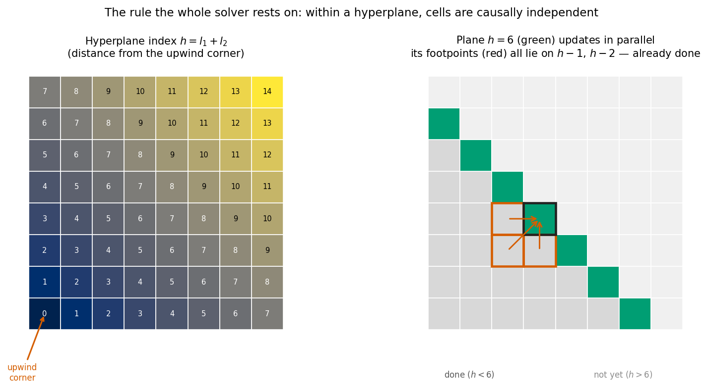
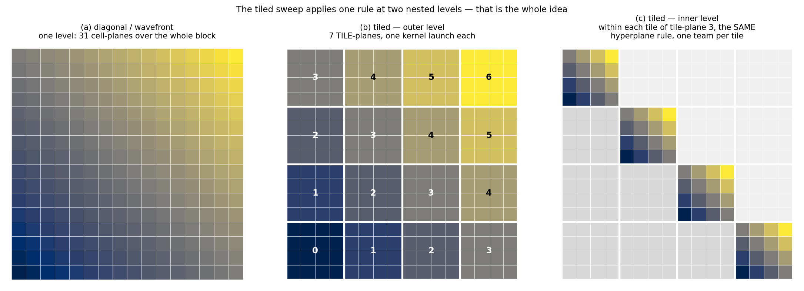
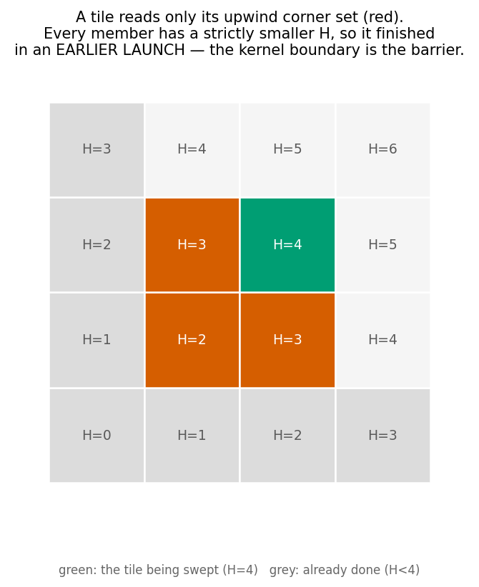
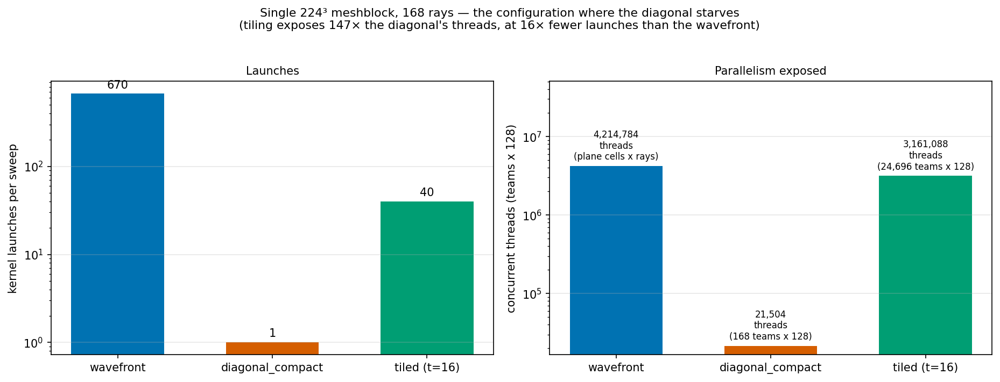
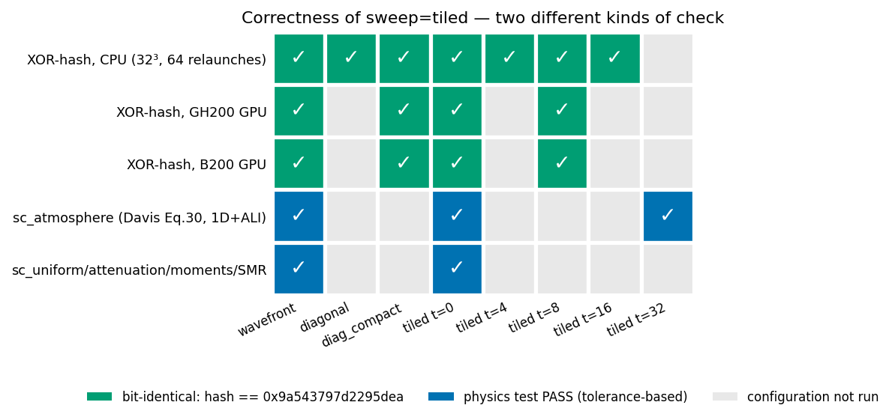
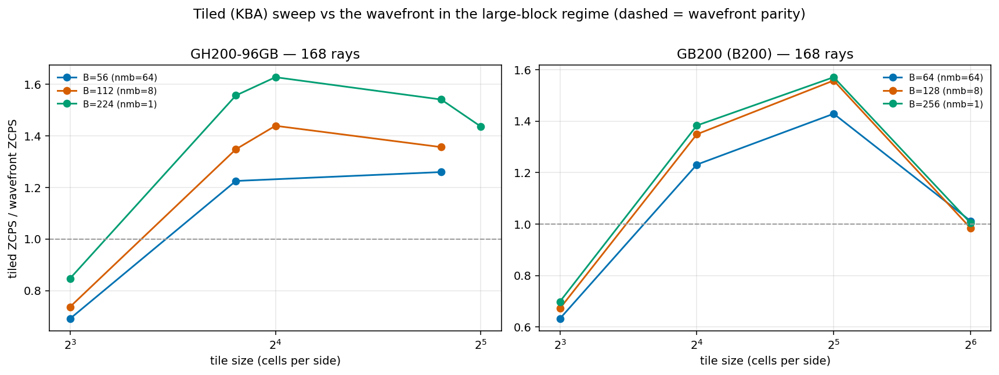

# The tiled (KBA) sweep — implementation report

*SC short-characteristics solver, branch `rt-sc`. Implemented and measured 2026-08-11.
Code: `src/nr_radiation/sc/formal_solution.cpp`, `nr_radiation.{hpp,cpp}`.
Measurements: Vista GH200 (job 904039) and B200 (904040). Schematics: `tile_schematics.py`.
Analysis: `tile_study.py`. Design rationale: `TILED_SWEEP_DESIGN.md`. Ledger row I7.*

This report explains what the tiled sweep does, why it is correct, how it was verified, and what
it buys. It is written to be readable without the design document.

---

## 1. The problem

The short-characteristics sweep is **causally sequential in space**: a cell cannot be updated
until the cells its ray passes through first have been. The only freedom is that cells on the
same *hyperplane* — same distance from the octant's upwind corner — are mutually independent.



Everything in the solver follows from the right-hand panel: a plane's footpoints always lie on
strictly lower planes, so a whole plane can be updated at once. The existing sweeps differ only
in how they map that fact onto the GPU:

| sweep | structure | parallelism | weakness |
|---|---|---|---|
| `wavefront` | one kernel launch per cell-plane | all blocks × angles × plane cells | `3B−2` launches |
| `diagonal_compact` | **one** launch; `h`-loop inside the kernel with `team_barrier()` | `league = nmb × nang_tot` teams | **team starvation** |

The diagonal's league does not depend on the block size at all. At one meshblock and 48 rays it
is **48 teams** on a 132-SM GPU, and each team must chew a 50,000-cell hyperplane with ~128
threads. That is why it collapses on large blocks — and large blocks are exactly what hydro
wants, and (per `LAG_STUDY.md`) what the iteration count wants for optically thin problems.

## 2. The method

Partition the meshblock into **tiles**, and run a wavefront **over tiles** — one kernel launch
per tile-hyperplane — with each team sweeping one tile internally exactly the way the diagonal
sweeps a small meshblock. The same rule, applied at two nested levels:



This is the Koch–Baker–Alcouffe (KBA) sweep, standard in parallel discrete-ordinates transport.
A big meshblock is made to behave like a bag of small ones.

### Why it is correct

The concern with any tiling is ordering. The answer is that **the kernel boundary is a global
barrier**, and the tile-plane ordering puts every dependency in an earlier launch:



The footpoint stencil reaches at most one cell in each direction, so a cell in tile `(ta,tb,tc)`
reads only that tile or its **upwind corner set** — `(ta−1,tb,tc)`, `(ta,tb−1,tc)`,
`(ta,tb,tc−1)` and the four diagonal combinations. Every member has at least one index
decremented, hence `ta+tb+tc` strictly smaller, hence a lower tile-plane, hence an earlier
launch. Each cell therefore reads the same fully-updated upwind values, in the same arithmetic
order, as every other sweep — so the result is **bit-identical**, not merely close.

> **This is not the tiling the ledger previously ruled out.** Ledger I1 correctly killed
> splitting a single *cell-plane* across teams *inside one launch*, where footpoints on planes
> `h−1…h−3` are only `team_barrier`-synchronized within a team and there is no ordering between
> teams. That partitions a plane; this partitions the volume, and uses launches as the barrier.
> Same word, different algorithm. The I1 row has been narrowed accordingly.

### What it changes on the GPU



For a single 224³ meshblock at 168 rays — the worst case — tiling at 16³ turns 168 teams into
**24,696**, using **40 launches** instead of the wavefront's 670. Three things move at once:
team count, launch count, and the per-team working set (a 16³ tile instead of a whole
224² plane), the last mattering most for a kernel that is latency-bound with the memory
interface only ~35 % busy.

## 3. Implementation

| piece | what it does |
|---|---|
| `BuildPlaneIndex()` (file-local) | the hyperplane rule, extracted and parameterized on dims. Returns the compact per-plane cell list for a box of any size. |
| `SC::BuildWavefrontIndex()` | now a thin caller of it — behaviour unchanged, one code path for the rule |
| `SC::BuildTileIndex()` | builds the two nested maps: cells-within-a-tile (device-side, the kernel's `h`-loop slices it) and tiles-within-a-block (host-side, it drives the launch loop) |
| `SC::FormalSolutionTiled()` | the kernel: host loop over tile-planes, one `TeamPolicy` launch each |
| `<nr_radiation>/sweep = tiled` | selects it |
| `<nr_radiation>/tile_size` | tile edge in cells; **0 = one tile per meshblock** |
| `<nr_radiation>/diag_team_size` | explicit team size, shared with `diagonal_compact` (§6) |

Both index maps are **pure functions of the dims** — identical for every meshblock, every tile
and every octant, since the octant sign only flips `i = lo+l1` into `i = hi−l1` — so both are
built once, lazily, exactly like the existing `wf_cell_`.

**Tiles must divide the meshblock.** Partial tiles would need a separate plane map per tile
shape for no real gain, and meshblock dims come from divisor ladders anyway. The guard fires at
construction with the list of valid divisors:

```
### FATAL ERROR ... <nr_radiation>/tile_size = 5 does not divide the meshblock x3 interior
size 32. Valid tile sizes for x3 are: 1 2 4 8 16 32
```

**The design property that made this safe to build:** at `tile_size = 0` there is one tile, one
tile-plane, one launch, and `league = nmb × nang_tot` — i.e. the tiled kernel *is*
`diagonal_compact`. So the refactor could be landed at the degenerate setting and checked for
bit-identity before any tiling was switched on.

## 4. Correctness results



The `sc_sweep_determinism` pgen freezes a gradient intensity field, runs the configured sweep 64
times from the same input, and XOR-hashes the result. Every configuration below produced
**`0x9a543797d2295dea`** — the same value the wavefront, diagonal and diagonal_compact sweeps
have always produced:

| where | configurations checked | result |
|---|---|---|
| CPU (serial, 32³ block) | wavefront, diagonal, diagonal_compact, tiled at `tile_size` 0, 4, 8, 16 | all identical |
| **GH200 GPU** | wavefront, diagonal_compact, tiled (`tile_size=8`) | all identical |
| **B200 GPU** | wavefront, diagonal_compact, tiled (`tile_size=8`) | all identical |

The GPU rows matter more than the CPU row. A serial CPU build has no concurrency, so it cannot
expose an ordering bug — it only checks the index algebra. The GPU checks run with full
parallelism and are now **baked into the submit scripts as a gate**: the perf sweep aborts if
the three sweeps disagree, so no throughput number is ever collected from a broken kernel.

`tile_size=4` on a 32³ block is 8 tiles per side and 22 tile-planes, so the cross-tile ordering
is genuinely exercised, not just the degenerate path.

Physics tests also pass with `sweep=tiled`: **`sc_atmosphere`** (Davis 2012 Eq. 30 semi-infinite
atmosphere, 1D, Jacobi-ALI — so the `lamstr` atomic path and the 1D branch are covered) at
`tile_size` 0 and 32, plus `sc_uniform`, `sc_attenuation`, `sc_moments`, `sc_uniform_smr` and
`sc_atmosphere_2mb`. A permanent deck, `sc_determinism_tiled.athinput` at `tile_size=8`, is
wired into both the CPU and GPU test suites, so real tiling stays covered.

*One caveat, stated for completeness:* with `use_ali=true` the `lamstr` `atomic_add`
accumulation order changes with any thread remapping, so ALI runs differ in the last bits. That
is benign and true of every sweep change. The determinism deck runs `ops=0, eps=1` ⇒
`use_ali=false` ⇒ no atomics, so the gate itself is unaffected.

## 5. Performance

Measured on Vista, clean whole-run ZCPS (never the fenced per-kernel metric), reference sweeps
run in the same job so the comparison is thermally paired.



At 168 rays, best tiled vs the wavefront:

| device | B | nmb | wavefront | best tiled | gain |
|---|--:|--:|--:|--:|--:|
| GH200 | 56 | 64 | 4.33e7 | 5.46e7 (t=28) | **1.26×** |
| GH200 | 112 | 8 | 4.30e7 | 6.18e7 (t=16) | **1.44×** |
| GH200 | 224 | 1 | 3.74e7 | 6.08e7 (t=16) | **1.63×** |
| B200 | 64 | 64 | 7.24e7 | 1.03e8 (t=32) | **1.43×** |
| B200 | 128 | 8 | 7.07e7 | 1.10e8 (t=32) | **1.56×** |
| B200 | 256 | 1 | 6.76e7 | 1.06e8 (t=32) | **1.57×** |

Against the best configuration previously known **anywhere** on each device's block ladder:

| device | rays | previous best | new best | gain |
|---|--:|---|---|--:|
| GH200 | 48 | 1.22e8 (wavefront, B=112) | **1.70e8** (tiled t=16, B=112) | **1.40×** |
| GH200 | 168 | 4.86e7 (diag_compact, B=28) | **6.18e7** (tiled t=16, B=112) | **1.27×** |
| B200 | 48 | 2.04e8 (diag_compact, B=32) | **2.85e8** (tiled t=32, B=128) | **1.40×** |
| B200 | 168 | 8.61e7 (diag_compact, B=32) | **1.10e8** (tiled t=32, B=128) | **1.28×** |

Four readings:

1. **The gain grows with block size** (1.26 → 1.44 → 1.63 on GH200) — the predicted mechanism,
   since large blocks are where the diagonal starved.
2. **The optimal tile is ~16³ on GH200 and ~32³ on B200** — roughly the block size at which the
   diagonal already wins on that device, which is what the design predicted, untuned.
3. **8³ tiles lose to the wavefront everywhere** (0.63–0.85×). Too much tile-face re-reading and
   too many tile-planes; the predicted lower bound is real and sits between 8 and 14.
4. **The new optimum sits at a large block** (B=112/128 rather than 28/32). That compounds:
   hydro is ~3× faster there, and per `LAG_STUDY.md` an optically thin problem at nmb=8 needs
   ~5 iterations instead of ~21 at nmb=512. Tiling is what makes the large-block regime
   affordable for radiation.

## 6. The `tile_size=0` regression — diagnosis

At `tile_size=0` the tiled kernel does exactly what `diagonal_compact` does, so the two should
match. Mostly they do — but not everywhere:

| device | B | nmb | rays | league | tiled t=0 / diagonal_compact |
|---|--:|--:|--:|--:|--:|
| GH200 | 56 | 64 | 48 | 3072 | 1.034 |
| GH200 | 56 | 64 | 168 | 10752 | 1.002 |
| GH200 | 112 | 8 | 48 | 384 | 1.204 |
| GH200 | 112 | 8 | 168 | 1344 | 1.048 |
| **GH200** | **224** | **1** | **48** | **48** | **0.682** |
| **GH200** | **224** | **1** | **168** | **168** | **0.834** |
| B200 | 64…256 | 64…1 | 48, 168 | 3072…48 | 0.978 – 1.013 |

The pattern is sharp once the **league size** column is added, which is what drawing the launch
schematic made obvious:

- The regression appears **only at the smallest leagues**, and its severity tracks starvation:
  0.682 at 48 teams, 0.834 at 168 teams, ≈1.0 at 384 and above.
- It is **GH200-only**. B200 at the same league sizes shows nothing (0.978–1.013). My earlier
  note that B200 regressed by 26 % was a misreading of the table — corrected here.
- It is **not run-to-run noise**: spread over 3 repeats is ≤0.9 % everywhere.
- It is **not register pressure** in the naive sense: the tiled kernel uses *fewer* registers
  than the diagonal (88 vs 94 on sm90), with the same theoretical occupancy.

**The hypothesis I tested (and it was wrong): `Kokkos::AUTO` resolves team size per kernel.**
Both kernels ask for `Kokkos::AUTO`, which picks from *that kernel's* register footprint, and
the two differ (88 vs 94 regs). When the league is 48 teams on a 132-SM device, team size is the
only remaining knob controlling residency, so a different AUTO pick would show up at full
strength — which would explain the severity-tracks-league pattern and the device dependence.

`FormalSolutionTiled()` now honours `<nr_radiation>/diag_team_size`, so both kernels can be
forced to the same explicit size. Job 904561 swept AUTO/64/128/256/512 × both kernels at
GH200 B=224. **The hypothesis is refuted** — see §7.

## 7. Team-size experiment — hypothesis refuted, and a bigger fish

GH200, B=224 (nmb=1), forcing both kernels to the same explicit team size (ZCPS with radiation on):

| team size | 48 rays: diag_compact | tiled t=0 | ratio | | 168 rays: diag_compact | tiled t=0 | ratio |
|--:|--:|--:|--:|--|--:|--:|--:|
| **AUTO** | 4.972e7 | 3.383e7 | 0.680 | | 3.393e7 | 2.804e7 | 0.826 |
| 64 | 2.83e7 | 1.83e7 | 0.646 | | 2.48e7 | 1.64e7 | 0.663 |
| **128** | **4.974e7** | **3.384e7** | 0.680 | | **3.388e7** | **2.802e7** | 0.827 |
| 256 | 7.53e7 | 5.60e7 | 0.744 | | 2.83e7 | 3.25e7 | 1.149 |
| 512 | **9.503e7** | **8.844e7** | 0.931 | | 2.59e7 | **3.305e7** | 1.278 |

**1. The hypothesis is dead.** `AUTO` and an explicit `128` give *identical* results to four
significant figures, for **both** kernels — so AUTO resolves to 128 for both, and it is not
selecting differently per kernel. Forcing them to match does not collapse the gap: at 128 the
ratio is still 0.680, exactly the AUTO value.

**2. What the gap actually is.** The two kernels have *different team-size sensitivities*, not
different AUTO picks. The tiled kernel wants a larger team than AUTO's 128: going 128 → 512 buys
it **2.61×** at 48 rays, while `diagonal_compact` gains **1.91×** over the same range. AUTO's
single choice of 128 simply suits `diagonal_compact` better. At 512 the ordering reverses at
168 rays (tiled 1.278× ahead). The *root* cause of the differing sensitivity remains unknown —
it is not register pressure (tiled uses fewer) and not the launch count (both launch once here).

**3. The finding that actually matters — `Kokkos::AUTO` leaves up to 2.6× on the table.**

| config | AUTO | best explicit | gain |
|---|--:|--:|--:|
| 48 rays, `diagonal_compact` | 4.97e7 | 9.50e7 (ts=512) | **1.91×** |
| 48 rays, `tiled t=0` | 3.38e7 | 8.84e7 (ts=512) | **2.61×** |
| 168 rays, `diagonal_compact` | 3.39e7 | 3.39e7 (ts=128) | 1.00× |
| 168 rays, `tiled t=0` | 2.80e7 | 3.31e7 (ts=512) | 1.18× |

**This contradicts a conclusion already in the ledger.** The A100 `diag_team_size` sweep
concluded "no help, AUTO optimal" — but that was measured at 176³ and nmu=6 only, and the
nmu=6 row above reproduces it (1.00×). At nmu=3 on a single block, AUTO is **1.9× off**. The
A100 conclusion does not generalise across angular order, and the ledger has been corrected.

**Untested lead:** every tiled number in §5 was taken at AUTO. At the *optimal* tile size the
league is large (24,696 teams at t=16), so starvation is gone and team size should matter much
less — but nobody has checked. If it does help, the 1.63× win is a floor, not a ceiling.

## 8. Does it compose with I2 (`angle_inner`)? — No, and the reason is structural

I7 and I2 both win most at large blocks and fix *different* bottlenecks (team starvation vs
gather coalescing), so composing them looked like free multiplication. `sweep=tiled` +
`ir_layout=angle_inner` was implemented (`FormalSolutionTiledAngleInner`, bit-identical, hash
`0x9a543797d2295dea` on CPU and on both GPUs) and measured. **It does not compose.**

GH200, B=112, single meshblock, vs the wavefront/normal baseline:

| config | 48 rays | 168 rays |
|---|--:|--:|
| baseline `wavefront` / `normal` | 1.00× | 1.00× |
| **I2 alone** (`wavefront` / `angle_inner`) | 1.06× | 1.22× |
| **I7 alone** (`tiled` / `normal`) | **1.40×** | **1.40×** |
| both, `tile_na=2` | 1.08× | 1.21× |
| both, `tile_na=4` | 0.69× | 1.14× |
| both, `tile_na=8` | 0.49× | 0.85× |
| both, `tile_na=32` | — | ~0.8× (measured at N★) |

The composed version is **monotonically worse as `tile_na` grows**, and even at its best point
(`tile_na=2`) it only ties I2 alone and stays well below I7 alone.

**Why — the two optimisations spend the same resource.** There is exactly one angle dimension.
I7 spends it on the *league*, turning angles into teams (`ntile·nmb·nang_tot`) — that is what
cures the diagonal's starvation. I2 spends it on the *lanes*, so consecutive threads walk
consecutive angles — that is what makes the gather coalesce. `tile_na` is the exchange rate
between them, and the sweep shows the trade is strictly losing in both directions:

* large `tile_na` → wide coalescing, but the league collapses by `tile_na`× (at 32 that is a
  24–28× reduction: 24,696 → 882 teams on GH200 at B=224; 8,064 → 96 on B200 at B=256, which is
  *worse starvation than the diagonal tiling exists to fix*);
* small `tile_na` → league preserved, but the coalesced run shrinks toward a single element,
  which is the ordinary uncoalesced gather with extra index arithmetic on top.

So **I7 and I2 are alternatives, not complements.** At large blocks the better single choice is
I7 (1.40× vs 1.22× here). This supersedes the "sequence I7 then I2" plan: there is nothing to
sequence.

*Two mistakes on the way to this result, recorded because both cost a job:* the first attempt
fixed `tile_na=32` — the value that maximally sacrifices team count — and so measured one bad
operating point rather than the hypothesis; and it reused the normal-layout N★, which OOMs under
`angle_inner` because the `ir_normal` companion doubles `ir` (hence the separate `N*_ai` in
REPORT2). Neither invalidated the idea; the `tile_na` sweep at a reduced mesh is what settled it.


## 9. Status and caveats

- **Not applicable to `ali_mode=gauss_seidel`.** `SweepUpdateGS` needs the global center-out
  completion-shell ordering to know when a cell has received its last octant; tiles break that.
  The tiled sweep covers the formal solution used by LTE and Jacobi-ALI.
- **Tiles must divide the meshblock** (guarded at construction).
- **Not yet the default.** Promoting `tiled` for `nmb ≤ 64` is the obvious next step, but that
  is a behaviour change, and the §6/§7 team-size sensitivity should be understood first — the
  right default may need to set an explicit team size rather than trust `Kokkos::AUTO`.
- **`Na` (angle blocking) is specified but not implemented** — it only pays once `ir` is
  angle-major (ledger I2+I8), so it waits on that experiment.
- Single-rank throughout. The MPI exchange has not been measured.

## 10. Reproduce

```bash
python3 rt-profiling/tile_schematics.py          # figures in rt-profiling/tile/
python3 rt-profiling/tile_study.py               # tables + tile_speedup.png
sbatch rt-profiling/gh200/submit_tile.sbatch     # the measurement (GH200; b200/ likewise)
```
